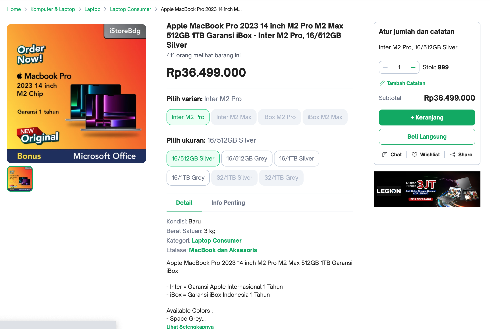

# Soal test maggang Backend engineer dengan Springboot

Berikut adalah soal/pertanyaan yang perlu dijawab oleh peserta maggang

## knowledge base

1. Apa yang anda ketahui tentang Rest API?
2. Apa yang anda ketahui tentang Server side and Client side processing?
4. Apa yang anda ketahui tentang Design pattern Dependency Injection?
5. Apa yang anda ketahui tentang Typescript dan Angular framework?
6. Apa yang anda ketahui tentang Microfrontend?

## Design modules

Dalam suatu schenario ada requirement membuat aplikasi e-commerse seperti Tokopedia seperti berikut:

1. Catalog, pelanggan mencari product di toko
    
2. Item, bisa melihat detail informasi produk
    
3. Cart, pelanggan bisa menambahkan produk yang ingin di beli ke keranjang
    
4. Setelah di checkout, masuk ke list transaction
    
5. Kita juga bisa liat detail transactionya
    

Kemudian temen-temen buat serta jelankan component communication terkait design UI/UX tersebut. contohnya coba breakdown componenet yang ada di module catalog trus coba dijelaskan gimana comunikasinya antara module tersebut.

## Praktek

Berdasarkan analisa tersebut, buat project monorepo (pada repository ini) dengan menggunakan framework [angular.io](https://angular.io/) seperti berikut specifikasinya:

- Data: data yang diperoleh harus menggunakan Rest API, temen-temen boleh menggunakan dummy api seperti [mockachino](https://www.mockachino.com/), [firebase](https://firebase.google.com/) atau sejenisnya
- CSS Framework: bebas, contohnya bootstrap, materialize-css, tailwindcss dan lain-lain
- arhitecture: Silahkan pilih monolith atau microfrontend